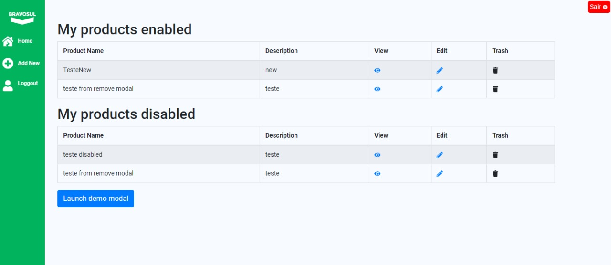
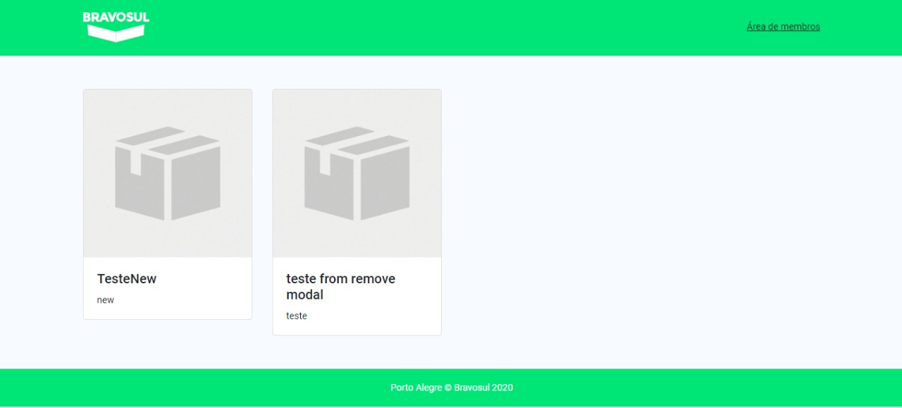
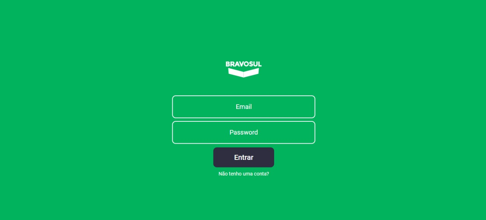
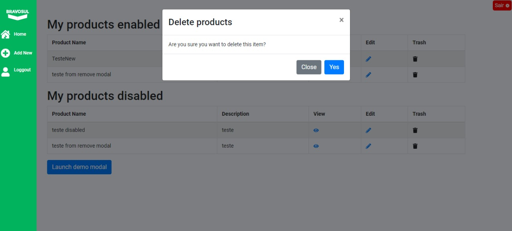
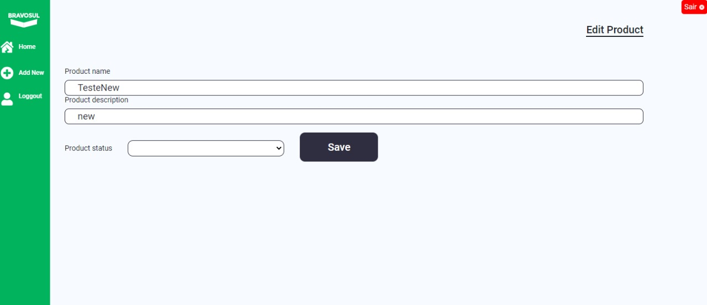
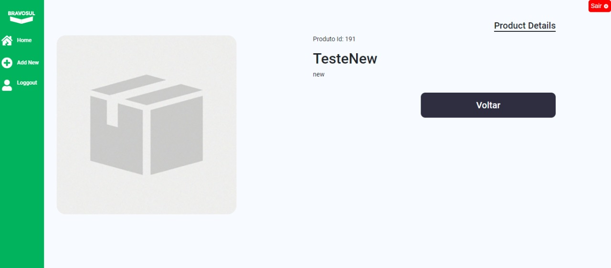

# Bravosul Custom Dashboard

Oi tudo bem?
Meu nome é Bravosul Custom Dashboard!

O meu objetivo aqui é ser útil para o seu negócio, estou apto para:
- Listar seus produtos
- Criar seus produtos
- Editar seus produtos
- Remover seus produtos


Futuramente eu posso ter novas funcionalidades como:
- Exibir preço dos produtos
- Exibir estoque
- Ter integração com um método de pagamento
- virar uma loja online (E-commerce)


Mas vamos lá, vou te mostrar como funciona o meu passo a passo!

# Observação
Se você preferir pular as instruções de instalação e quiser acompanhar a minha versão beta online, fique a vontate para acessar aqui:
http://development.nodejs202.uni5.net/

# login
Se não quiser criar uma conta, eu vou disponibilizar um usuário para você testar:
{
	"email":"demo@demo.com",
	"password":"123456"
}

Link da API online: http://development.nodejs202.uni5.net:21007/

Link API no Github: https://github.com/lucca-rodrigues/Bravosul-Dashboard-api

# Instruções:

- Para me instalar na sua máquina basta fazer um
```sh
git clone git@github.com:lucca-rodrigues/Bravosul-Dashboard-ReactJS.git
```

Depois entrar na pasta do projeto com:
```sh
cd Bravosul-Dashboard-ReactJS
```

obs: se você achar este nome muito complicado, você pode alterar o nome da pasta tranquilamente que eu não vou ficar triste 🙂

Agora que ja entrou na pasta, basta rodar
```sh
yarn install ou npm install
```

Depois que tiver instalado todas as dependências basta rodar
```sh
yarn start ou npm start
```

logo uma página será aberta em seu navegador com a url: http://localhost:3000 se não abrir automaticamente você pode clicar no link que será exibido no terminal

Pronto agora eu ja estou te vendo! 🙂😉

Como você é novo aqui eu vou te explicar, eu funciono com autenticação de usuário com uma criada em Node e Adonis.

Se você quiser ver minha api, pode acessar aqui: https://github.com/lucca-rodrigues/Bravosul-Dashboard-api

Neste momento, você deve estar vendo uma listagem de produtos né?
Essa listagem é de todos os produtos cadastrados e ativos dentro da plataforma, mas como você precisa acessar o painel vamos lá:

No canto superior direito, tem um botão com um link para "Área de membros", basta clicar neste botão e acessar o login ou criar um usuário em alguns segundos.


Clique em entrar e você ja deverá estar visualizando uma tela assim:



Esta é a listagem de Produtos que você tem, existe uma separação de produtos ativos e inativos para facilitar o seu gerenciamento!

Nesta tela você pode ver os produtos, visualizar os detalhes dele, editar e remover. Basta clicar nos ícones respectivos que as ações serão executadas.

Como eu sou uma versão incial, pode ser que ocorra alguns bugs mas por favor tenha paciência comigo pois estou tentando melhorar 😅😄.


# Dashboard:

  O Dashboard é bem simples, basta navegar no menu lateral entre "home" e "add new" para acessar as telas.
  Algumas navegações são feitas diretamente na listagem dos produtos, por isso o meu menú só tem os itens essênciais.

# Layout

O meu layout foi projetado pensando apenas na identidade visual da Bravosul e seu site atual, mas para uma v2.0 eu ja devo ter alguns paranauê de  UI e UX para melhorar ainda mais.


# Screenshots
Aqui vai algumas imagens minhas:









# Agradecimentos

Desde já eu agradeço a você por ter se interessado por mim, estou aqui para facilitar a sua vida, qualquer coisa não deixe de fazer contato:


### 📱 Social

Me acompanhe nas minhas redes sociais.

<p align="center">

   <a href="https://github.com/lucca-rodrigues" target="_blank" >
    </a>

  <a href="https://www.instagram.com/_luccaoficial/" target="_blank" >
    </a>

  <a href="https://www.facebook.com/luccarodriguesgtr" target="_blank" >
    </a>

  <a href="https://www.linkedin.com/in/lucas-rodrigues-66a2b07a/" target="_blank" >
    </a>

  <a href="mailto:contato.luccarodrigues@gmail.com" target="_blank" >
    </a>

  <a href="https://api.whatsapp.com/send?phone=554198938062" target="_blank" >
    </a>
</p>

---

Feito com ❤️ by **Lucca Rodrigues** 🤙
